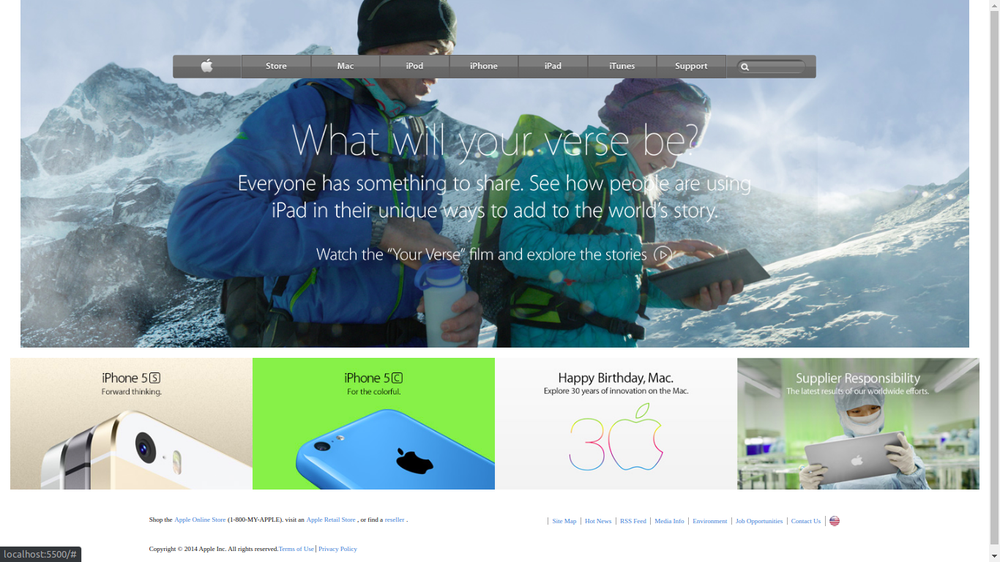

# Apple Website clone - page

> This project consists of building a webpage using images as a background and adding gradients to elements. The goal is to make a clone of old an old version of the Apple website webpage..

Additional description about the project and its features.

## Built With

- HTML && CSS

## Live Demo

[Live Demo Link](https://rawcdn.githack.com/Cyrus-Kiprop/apple-clone/7eb302939b62b187360a9e6223aa84820a3c1ca0/index.html)

## Getting Started

**Clone the master branch.**
**Open the files using your favourite text editor or IDE. VS vode is recommened. Right click on the index.html files and click on start file using live server. Cheers!!**

To get a local copy up and running follow these simple example steps.

### Prerequisites

- Favourite IDE. VS code recommended (with live server plugin installed).
- Open the files via IDE.
- Right click on the index.html file and click on open with live server.
- That's it!! Enjoy.

### Setup

-[Click here](https://github.com/microverseinc/linters-config/tree/master/css) to configure linter.

### Run tests

-run npx stylint .

## Authors

👤 **Cyrus Kiprop**

- Github: [Cyrus-Kiprop](https://github.com/Cyrus-Kiprop)
- Twitter: [@kipropJS](https://twitter.com/kipropJS)
- Linkedin: [cyrus-kiprop](https://www.linkedin.com/in/cyrus-kiprop-ba7320120/)

## 🤝 Contributing

Contributions, issues and feature requests are welcome!

Feel free to check the [issues page](https://github.com/Cyrus-Kiprop/apple-clone/issues).

## Show your support

Give a ⭐️ if you like this project!

## Acknowledgments

- User interface is the process of shifting from chaotic complexity to elegant simplicity -- Henrique.

## 📝 License

This project is [MIT](lic.url) licensed.
